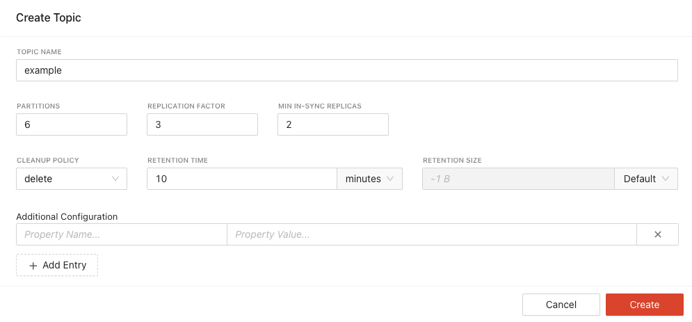
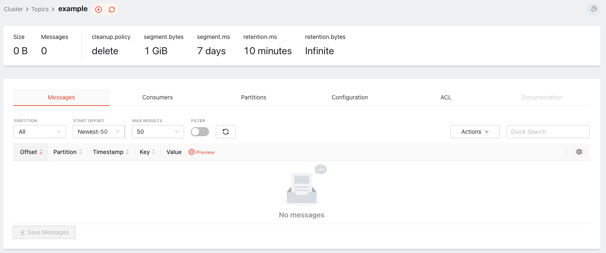
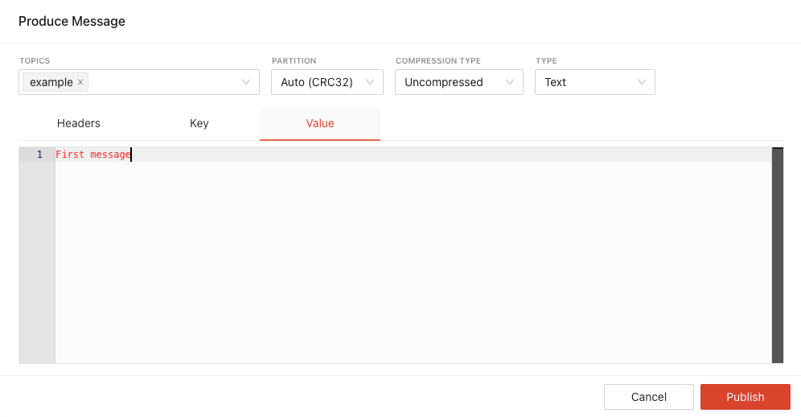
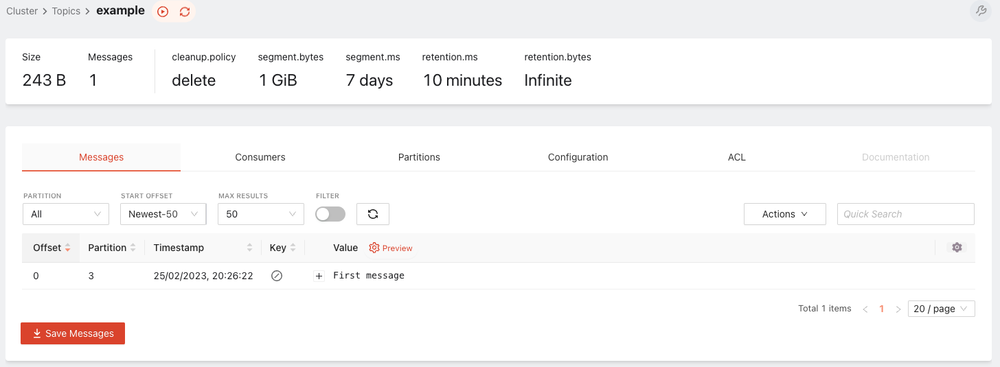

# Создание топика

Откройте веб-интерфейс [Redpanda Console](http://localhost:8080/topcs) и перейдите на вкладку "Topics". Создайте топик "example".

- Имя топика: `example`
- Число партиций: `6`
- Фактор репликации: `3`
- Минимальное число ISR: `2`
- Политика устаревания: `10` минут



Перейдите по ссылке на [страницу уже созданного Kafka-топика](http://localhost:8080/topics/example#messages).



Запишите в топик ваше первое сообщение (Actions — Publish messages).



Если вы всё сделали верно, то в топике появится первое сообщение.



Усложним пример: запустим консумер и продюсер, что пишут и читают топик `example`. В `docker-compose.yml` мы заранее подготовили примеры программ продюсера и консумера. Запустите приложения:

```bash
docker-compose --profile app up -d
```

Если вы всё сделали верно, то в списке контейнеров вы увидите программу-консумер и продюсер:

```
NAME                IMAGE                                           COMMAND                   SERVICE             CREATED             STATUS              PORTS
consumer-1          kafka-workshop-consumer-1                       "app"                     consumer-1          5 seconds ago       Up 4 seconds
grafana             docker.io/grafana/grafana:latest                "/run.sh"                 grafana             6 minutes ago       Up 6 minutes        0.0.0.0:3000->3000/tcp
kafka-1             kafka-workshop-kafka-1                          "/opt/bitnami/script…"    kafka-1             6 minutes ago       Up 6 minutes        9092/tcp
kafka-2             kafka-workshop-kafka-2                          "/opt/bitnami/script…"    kafka-2             6 minutes ago       Up 6 minutes        9092/tcp
kafka-3             kafka-workshop-kafka-3                          "/opt/bitnami/script…"    kafka-3             6 minutes ago       Up 6 minutes        9092/tcp
kafka-exporter      docker.io/bitnami/kafka-exporter:latest         "kafka_exporter --ka…"    kafka-exporter      6 minutes ago       Up 6 minutes        9308/tcp
producer-1          kafka-workshop-producer                         "app"                     producer            5 seconds ago       Up 4 seconds
prometheus          quay.io/prometheus/prometheus:latest            "/bin/prometheus --c…"    prometheus          6 minutes ago       Up 6 minutes        0.0.0.0:9090->9090/tcp
ui                  docker.redpanda.com/vectorized/console:v2.1.1   "/bin/sh -c 'echo \"$…"   ui                  6 minutes ago       Up 6 minutes        0.0.0.0:8080->8080/tcp
zookeeper           docker.io/bitnami/zookeeper:3.8                 "/opt/bitnami/script…"    zookeeper           6 minutes ago       Up 6 minutes        2181/tcp, 2888/tcp, 3888/tcp, 8080/tcp
```

✅ Готово. Переходите к [работе с продюсерами](./004-producers.md).
