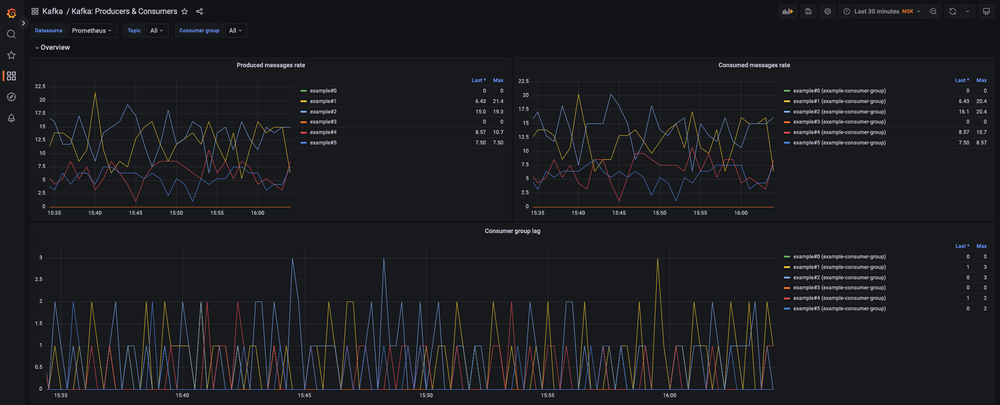

# Наблюдаемость Kafka

Пока мы экспериментировали с консумерами и продюсерами, Prometheus-сервер собирал метрики с Kafka-брокеров. Давайте уделим время последней, но не по важности, теме наблюдаемости Kafka. 

Откройте [Grafana-дашборд "Kafka: Producers & Consumers"](http://localhost:3000/d/kafka-consumers-and-producers).

- **Имя пользователя**: `admin`
- **Пароль**: `admin`

Kafka представляет широкие возможности для снятия телеметрии с JMX. В экосистеме Prometheus для снятия метрик мы используем JMX Exporter с описанием правил сбора метрик MBeans. В других системах мониторинга вы можете использовать другие инструменты.



Откройте [Grafana-дашборд "Kafka: Performance"](http://localhost:3000/d/kafka-performance) и оцените изменение ключевых метрик.

> Для развёртки продуктивного кластера советуем ознакомиться с [рекомендациями Confluent по сбору метрик](https://docs.confluent.io/platform/current/kafka/monitoring.html). В примере используем только часть метрик, чтобы не переусложнять понимание основных процессов.

---

✅ Готово. Поздравляю, вы завершили базовый курс знакомства с Kafka.

Для остановки стенда используйте команду:

```bash
docker-compose --profile app down
```

🎉 Спасибо, что приняли участие в интенсиве «Kafka за 90 минут»!

---

[Вернуться на главную](../../README.md)